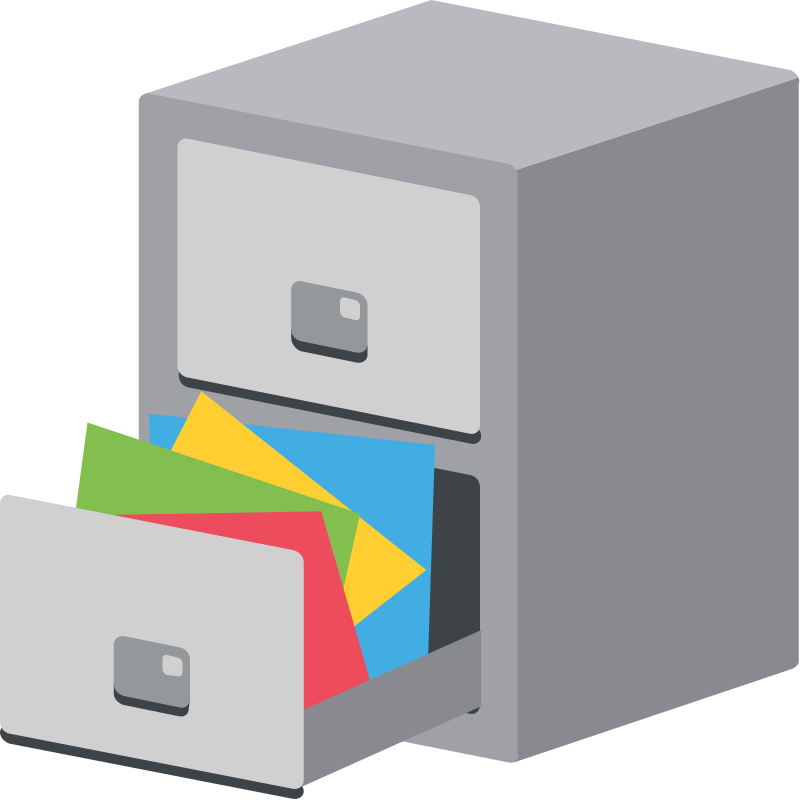

  

# DocuMS

`Status: In-progress`

A complete document management service. 

## Features

Functional requirements
- Upload documents
- Download documents
- Delete documents
- Folder hierarchy
- Metadata management
- Versioning
- Search by name/metadata
- Access control (user/role based)
- Share documents (optional enhancement)

Non-functional requirements
- Secure (private documents)
- Scalable to millions of documents
- Highly available
- Low latency for upload/download
- Cost efficient
- Auditability
- Maintainable & extensible

## Technical Flow
Client → NestJS (get presigned URL)
Client → S3 (upload directly)

Benefits:
Reduced backend load
Better scalability
Faster uploads
Lower infra cost